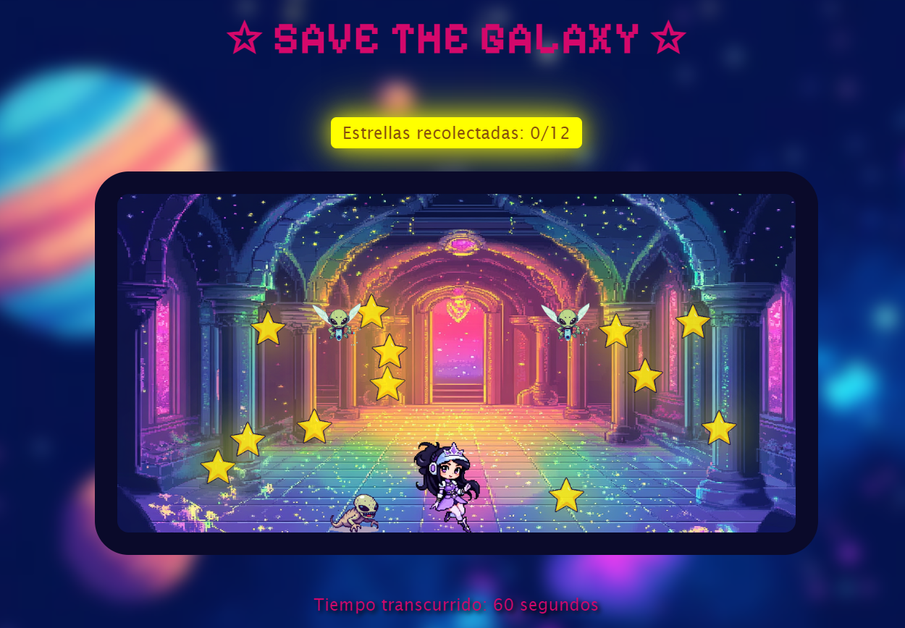

<h1 align="center">⭐ Save the Galaxy Mini-Game ⭐</h1>

**Save the Galaxy Mini-Game** Save the Galaxy is a desktop-only mini-game where you control a galactic warrior princess who collects stars to gain power and save the galaxy from alien invaders. The game is built using JavaScript, HTML, and CSS, following Object-Oriented Programming principles.

⭐ Technologies Used

-   **JavaScript**: Core game logic and mechanics.
-   **HTML**: For the page structure.
-   **CSS**: For styling and animation.

⭐ How to Play

-   Open the game file in your browser.
-   Move the galactic warrior princess using the arrow keys.
-   Collect all the stars while avoiding alien enemies.

⭐ Controls

-   **Left and Right**: Use the left and right arrow keys to move the warrior princess.
-   **Jump**:
    -   Low jump: Press the up arrow key.
    -   High jump: Keep the up arrow key pressed.

⭐ Game Features

-   Object-Oriented Programming: The game is structured with **classes**, **polymorphism**, and **inheritance**.
-   Timer: Track how fast you can collect all the stars.
-   Enemies: Dodge aliens to avoid losing and continue collecting stars.
-   Alerts: A notification appears when all stars are collected. Another alert appears if you’re caught by aliens, causing the game to restart.

